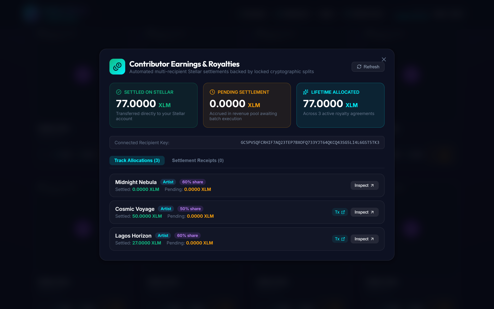
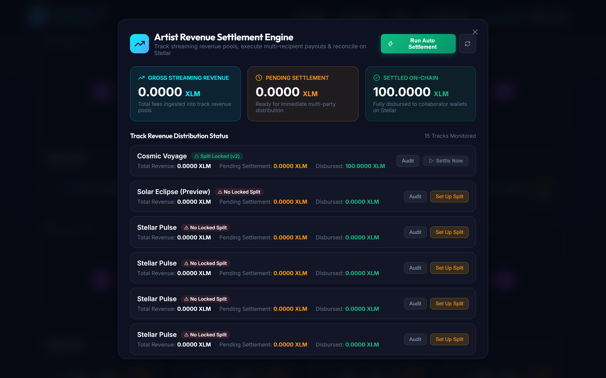

# 🎵 Stellar Music — Smart Contracts (`stellar-music-contracts`)

[](https://stellar-music-app.netlify.app)
[](https://stellar.expert/explorer/testnet)
[](https://stellar.org)
[](https://github.com/Stellar-Music/stellar-music-contracts)

The decentralized financial engine and settlement protocol for **Stellar Music**, built on **Soroban (Rust SDK v22)** for the **Stellar Network**.

---

## 📌 Protocol Overview

Stellar Music eliminates opaque royalty distribution and intermediary payment delays by embedding revenue agreements and payouts directly into Stellar smart contracts:

1. **Non-Custodial Financial Enforcement**: Neither artists, listeners, nor platform servers have unilateral custody of funds. Smart contract rules govern all transactions.
2. **Cryptographic Revenue Split Agreements**: Collaborators (producers, vocalists, songwriters) register and sign immutable split agreements on-chain. Exactly 10,000 basis points (100.00%) are allocated, verified, and locked.
3. **Automated Multi-Recipient Settlements**: Streaming revenue ingested into track pools is automatically distributed to all verified collaborator wallets in a single atomic transaction.
4. **Zero-Leak Integer Stroop Math**: 1 XLM = 10,000,000 stroops. Indivisible remainder dust is deterministically assigned to the primary collaborator (index 0), guaranteeing zero financial rounding leakage across any number of split participants.

```
                     ┌────────────────────────────────┐
                     │     Music Pass Streaming Fee   │
                     └───────────────┬────────────────┘
                                     │
                                     ▼
                     ┌────────────────────────────────┐
                     │    Track Revenue Allocation    │
                     └───────────────┬────────────────┘
                                     │
                       (Locked Split Agreement Check)
                                     ▼
     ┌────────────────────────────────────────────────────────────────┐
     │                Soroban Split Settlement Engine                 │
     │  - Verifies Agreement Status == LOCKED                         │
     │  - Computes Integer Basis Points (gross_stroops * bps / 10000) │
     │  - Allocates Indivisible Remainder Stroops to Primary Artist   │
     │  - Atomically Transfers XLM to Every Contributor Wallet        │
     │  - Emits SettlementReceipt Event & Ledger Audit Record         │
     └───────┬──────────────────────┬──────────────────────┬──────────┘
             │                      │                      │
             ▼                      ▼                      ▼
    [ Producer (40%) ]     [ Vocalist (35%) ]      [ Writer (25%) ]
```

---

## 🛠️ Smart Contract Specification

### Core Methods

| Method | Parameters | Returns | Description |
| :--- | :--- | :--- | :--- |
| `initialize` | `admin: Address` | `Result<(), Error>` | Initializes contract administrator. |
| `register_track` | `artist: Address`, `pass_price: i128`, `metadata_uri: String` | `Result<u64, Error>` | Registers track on-chain with pass price and metadata URI. Emits `track::reg`. |
| `update_track` | `artist: Address`, `track_id: u64`, `pass_price: i128`, `is_active: bool` | `Result<(), Error>` | Updates track metadata and active status. Requires artist auth. |
| `purchase_pass` | `listener: Address`, `track_id: u64`, `token: Address` | `Result<PassInfo, Error>` | Purchases access pass. Transfers payment tokens directly to artist account. |
| `create_split_agreement` | `artist: Address`, `track_id: u64`, `agreement_hash: BytesN<32>`, `recipients: Vec<SplitRecipient>` | `Result<u32, Error>` | Registers a new split agreement version. Validates 10,000 bps invariant and recipient uniqueness. |
| `approve_split_agreement` | `contributor: Address`, `track_id: u64`, `version: u32`, `agreement_hash: BytesN<32>` | `Result<bool, Error>` | Contributor cryptographically approves agreement terms. Automatically transitions status to `LOCKED` when all parties sign. |
| `get_split_agreement` | `track_id: u64`, `version: u32` | `Option<SplitAgreement>` | Queries full agreement metadata, version, terms, approvals, and lock state. |
| `get_active_locked_split` | `track_id: u64` | `Option<SplitAgreement>` | Fetches active locked agreement ready for settlement execution. |
| `calculate_split_allocations` | `track_id: u64`, `gross_amount: i128` | `Result<Vec<RecipientPayout>, Error>` | Pure dry-run calculation returning exact stroop allocations and dust assignment. |
| `execute_split_settlement` | `caller: Address`, `track_id: u64`, `gross_amount: i128`, `token: Option<Address>` | `Result<SettlementReceipt, Error>` | Executes atomic multi-recipient transfer on Stellar backed by locked agreement. Emits `settle::exec`. |
| `get_settlement` | `settlement_id: u64` | `Option<SettlementReceipt>` | Queries on-chain settlement receipt by global settlement index. |
| `get_settlement_count` | *None* | `u64` | Returns total lifetime settlements executed on the contract. |
| `get_track_settled_total` | `track_id: u64` | `i128` | Returns lifetime cumulative settled amount for a specific track. |

---

## 🔒 Financial Invariants & Security Architecture

1. **Exact 100.00% Allocation (`InvalidBasisPoints`)**: Every agreement must total exactly 10,000 basis points. Under-allocation or over-allocation is rejected at transaction submission.
2. **Duplicate Prevention (`DuplicateRecipient`)**: A wallet cannot be specified multiple times within the same split agreement.
3. **Lock Gatekeeper (`AgreementNotLocked`)**: Settlement execution is strictly prohibited unless the agreement has reached the `LOCKED` state through unanimous multi-party cryptographic approvals.
4. **Remainder Dust Zero-Leak Invariant**:
   $$\sum_{i=0}^{n-1} \text{actual\_amount}_i = \text{gross\_amount}$$
   $$\text{dust} = \text{gross\_amount} - \sum_{i=0}^{n-1} \left( \lfloor \frac{\text{gross\_amount} \times \text{bps}_i}{10000} \rfloor \right)$$
   $$\text{actual\_amount}_0 = \text{calculated\_amount}_0 + \text{dust}$$
5. **Replay & Hash Binding**: Every approval requires passing the agreement's SHA-256 hash. If terms are modified, previous signatures are rendered invalid.

---

## 🛑 Smart Contract Error Codes & Failure Modes

The contract implements strongly typed errors via `soroban_sdk::contracterror`. Any assertion failure returns the corresponding enum error code to the caller:

| Error Code | Variant Name | Trigger Condition & Description |
| :---: | :--- | :--- |
| `1` | `AlreadyInitialized` | Attempted to re-initialize contract state. The `initialize` function can only execute once. |
| `2` | `NotInitialized` | Contract storage has not been initialized with an administrator address. |
| `3` | `NotAuthorized` | Caller authentication check failed; transaction signer is unauthorized. |
| `4` | `TrackNotFound` | The requested `track_id` does not exist on-chain. |
| `5` | `TrackInactive` | Track has been deactivated by the artist; access pass purchases are halted. |
| `6` | `PassAlreadyPurchased` | The listener wallet already owns an active access pass for this track. |
| `7` | `InvalidPrice` | Pass price must be non-negative (`pass_price >= 0`). |
| `8` | `InvalidBasisPoints` | Sum of recipient basis points does not equal exactly 10,000 (100.00%). |
| `9` | `SplitAlreadyLocked` | Agreement is already in `LOCKED` status and cannot be modified or re-approved. |
| `10` | `AgreementNotFound` | Specified split agreement version does not exist for the track. |
| `11` | `NotARecipient` | Signing address is not registered in the split agreement recipient list. |
| `12` | `AlreadyApproved` | Contributor has already signed and approved this agreement version. |
| `13` | `HashMismatch` | Provided SHA-256 agreement hash does not match the terms registered on-chain. |
| `14` | `DuplicateRecipient` | A recipient wallet address was provided more than once in the same agreement. |
| `15` | `NoRecipients` | Agreement was submitted with an empty recipient list. |
| `16` | `AgreementNotLocked` | Settlement execution attempted on an agreement that has not been `LOCKED` by all contributors. |
| `17` | `InvalidSettlementAmount` | Settlement gross amount must be strictly greater than zero (`gross_amount > 0`). |

---

## 📸 Product Functionality Walkthrough

The smart contract suite directly powers the frontend and backend workflows across all three protocol levels:

### 1. Catalog Discovery & Non-Custodial Streaming
Verified on-chain tracks are streamed directly with authenticated HTTP 206 range delivery. Persistent player manages playback, volume, and seeking.


---

### 2. Level 1 — Non-Custodial Music Pass Access (`purchase_pass`)
Listeners purchase track access passes using native Stellar Testnet XLM. Funds transfer directly to artist accounts with cryptographic replay protection.


---

### 3. Level 2 — Collaborator Revenue Split Studio (`create_split_agreement`, `approve_split_agreement`)
Collaborators configure exact basis points totaling 10,000 (100.00%). When all parties cryptographically sign, the status automatically transitions to `LOCKED`.


---

### 4. Level 3 — Contributor Royalty & Earnings Dashboard (`get_track_settled_total`)
Collaborators monitor lifetime earnings, pending pool royalties, and settled XLM on Stellar with direct links to blockchain transaction receipts.


---

### 5. Level 3 — Artist Automated Settlement Engine (`execute_split_settlement`)
Artists view catalog gross revenue, pending balances, and execute automated multi-recipient settlement batches in a single on-chain transaction.


---

### 6. Level 3 — Track Revenue Auditor (`calculate_split_allocations`, `get_settlement`)
Publicly inspect per-track revenue pools, verify immutable split terms, confirm remainder dust allocation to Index 0, and audit on-chain settlement receipts.


---

## 📊 Data Structures

```rust
pub struct SplitRecipient {
    pub recipient: Address,
    pub role: Symbol,             // e.g. "artist", "producer", "songwrtr", "engineer"
    pub share_basis_points: u32, // 10,000 bps = 100.00%
}

pub struct SplitAgreement {
    pub track_id: u64,
    pub version: u32,
    pub agreement_hash: BytesN<32>, // Deterministic SHA-256 of agreement terms
    pub recipients: Vec<SplitRecipient>,
    pub approvals: Vec<Address>,   // Collected cryptographic approvals
    pub is_locked: bool,           // Immutable once all required parties sign
    pub created_at: u64,
    pub locked_at: u64,
}

pub struct SettlementReceipt {
    pub settlement_id: u64,
    pub track_id: u64,
    pub agreement_version: u32,
    pub gross_amount: i128,
    pub recipient_count: u32,
    pub settled_at: u64,
    pub ledger_sequence: u32,
}

pub struct RecipientPayout {
    pub recipient: Address,
    pub role: Symbol,
    pub basis_points: u32,
    pub amount: i128,
}
```

---

## 🧪 Testing & Verification

The contract includes comprehensive test suites covering unit logic, multi-party signature flows, basis points validation, and multi-recipient settlement execution:

```bash
# Run contract unit tests
cargo test --lib

# Build optimized WASM binary for deployment
cargo build --target wasm32-unknown-unknown --release
```

All 12 automated test cases pass with zero failures:
* `test_contract_initialization` — Initializes contract state and verifies admin configuration.
* `test_register_track` — Registers track with pricing and metadata URI.
* `test_purchase_pass_and_payment_transfer` — Executes access pass purchase and non-custodial token transfer.
* `test_level2_create_split_agreement_success` — Creates new split agreement with multi-recipient share configuration.
* `test_level2_reject_invalid_basis_points` — Rejects split agreements whose basis points do not sum to exactly 10,000 (100.00%).
* `test_level2_reject_duplicate_recipient` — Enforces address uniqueness within a split agreement.
* `test_level2_multi_party_signing_flow_and_lock` — Verifies multi-party cryptographic signature collection and automated transition to `LOCKED`.
* `test_level2_non_recipient_cannot_approve` — Prevents unauthorized third parties from signing split agreements.
* `test_level2_hash_mismatch_rejection` — Rejects approvals submitted against modified agreement terms.
* `test_level3_settlement_calculation_and_execution` — Computes 4-way multi-recipient settlement and verifies atomic execution.
* `test_level3_settlement_rejection_when_unlocked` — Prohibits revenue settlement against unconfirmed or unlocked agreements.
* `test_level3_settlement_invariant_and_rounding_dust` — Validates stroop remainder dust allocation to Index 0 with zero rounding leak.

---

## 🌐 Network Configuration

* **Network**: Stellar Testnet
* **Soroban RPC**: `https://soroban-testnet.stellar.org`
* **Network Passphrase**: `Test SDF Network ; September 2015`
* **Testnet Explorer**: [Stellar Expert Explorer](https://stellar.expert/explorer/testnet)
* **Frontend Web Application**: [https://stellar-music-app.netlify.app](https://stellar-music-app.netlify.app)
